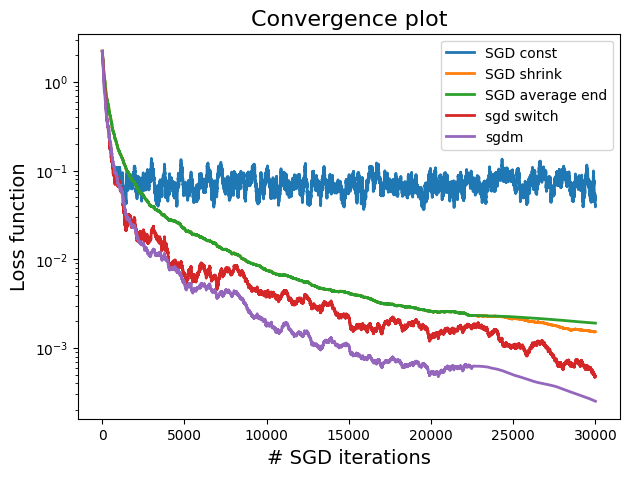
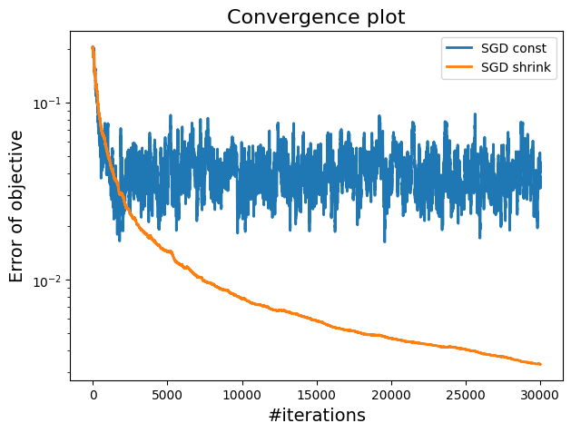
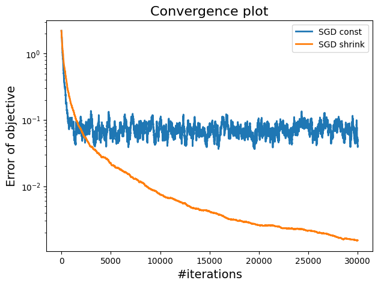
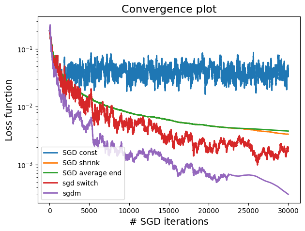
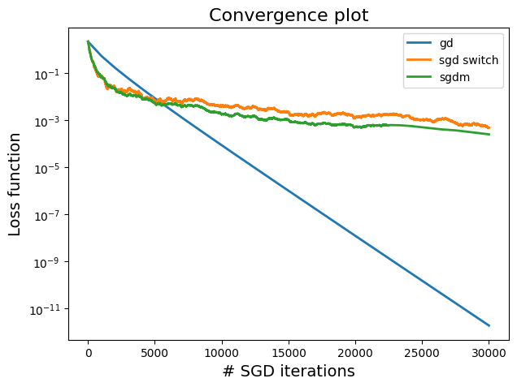
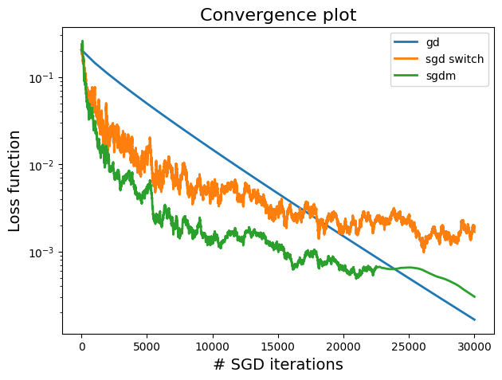

## Project Overview
This project evaluates the performance and convergence of various stochastic gradient descent (SGD) variants and traditional gradient descent methods with different step size settings. The methods are tested on two synthetic datasets: one with high correlation and one with low correlation among features, focusing on solving the ridge penalized empirical risk minimization for regression.

## Experimental Results
#### Comparing All Variants
- Low Correlation Data (ρ=0.1): The SGD switch variant performs well initially, but SGD with momentum (β=0.4\beta = 0.4β=0.4) ultimately provides the best performance, with the lowest error and most stable convergence.
<<<<<<< HEAD
<figure>

<!--  -->
=======
  <figure>

>>>>>>> 78ed8becce4f9330f7cd1034c9c665965581ecd1

<figcaption>Constant step and shrinking steps SGD: plots of  the errors of the objective vs iterations for 1) low correlated data and 2) higher correlated data.</figcaption>

</figure>
<<<<<<< HEAD
- High Correlation Data (ρ=0.7): All methods are impacted by high correlation, but SGD with momentum (β=0.6\beta = 0.6β=0.6) outperforms the others by achieving  the lowest loss and distance to the minimum, effectively managing the noise introduced by correlated features.

<figure>
<!--  -->
=======

- High Correlation Data (ρ=0.7): All methods are impacted by high correlation, but SGD with momentum (β=0.6\beta = 0.6β=0.6) outperforms the others by achieving  the lowest loss and distance to the minimum, effectively managing the noise introduced by correlated features.
  <figure>

>>>>>>> 78ed8becce4f9330f7cd1034c9c665965581ecd1

<figcaption>Constant step and shrinking steps SGD: plots of  the errors of the objective vs iterations for 1) low correlated data and 2) higher correlated data.</figcaption>

</figure>

<<<<<<< HEAD
#### Comparing Full Gradient Descent to SGD with Momentum and Switch Variants
- Low Correlation Data (ρ=0.1): Gradient Descent performs best overall, smoothly converging to very low loss values and effectively reaching the minima. SGD momentum with β=0.4\beta = 0.4β=0.4 performs well, surpassing SGD switch in later stages with lower loss and better convergence, but only Gradient Descent effectively reaches the minima.
<figure>

<!--  -->
=======

#### Comparing Full Gradient Descent to SGD with Momentum and Switch Variants
- Low Correlation Data (ρ=0.1): Gradient Descent performs best overall, smoothly converging to very low loss values and effectively reaching the minima. SGD momentum with β=0.4\beta = 0.4β=0.4 performs well, surpassing SGD switch in later stages with lower loss and better convergence, but only Gradient Descent effectively reaches the minima.
  <figure>

>>>>>>> 78ed8becce4f9330f7cd1034c9c665965581ecd1

<figcaption>Constant step and shrinking steps SGD: plots of  the errors of the objective vs iterations for 1) low correlated data and 2) higher correlated data.</figcaption>

</figure>
<<<<<<< HEAD
- High Correlation Data (ρ=0.7): SGD momentum with β=0.6\beta = 0.6β=0.6 outperforms the other variants by achieving the lowest loss and distance to the minimum. Gradient Descent, while smooth, is slower due to high correlation noise, and SGD switch struggles with oscillations. Overall, all methods perform relatively similarly in the presence of high correlation.
<figure>
<!--  -->
=======

- High Correlation Data (ρ=0.7): SGD momentum with β=0.6\beta = 0.6β=0.6 outperforms the other variants by achieving the lowest loss and distance to the minimum. Gradient Descent, while smooth, is slower due to high correlation noise, and SGD switch struggles with oscillations. Overall, all methods perform relatively similarly in the presence of high correlation.

<figure>

>>>>>>> 78ed8becce4f9330f7cd1034c9c665965581ecd1

<figcaption>Constant step and shrinking steps SGD: plots of  the errors of the objective vs iterations for 1) low correlated data and 2) higher correlated data.</figcaption>

</figure>

# Conclusion
This project investigated various gradient methods on two datasets with different correlation levels, focusing on linear regression. The experiments highlighted that high correlation introduces more noise and instability in gradient estimates, challenging convergence. In such cases, methods like shrinking stepsizes or momentum demonstrated better performance by managing noise effectively. Low correlation, on the other hand, resulted in reduced noise, facilitating smoother and more efficient convergence across all methods. The insights gained from this study emphasize the importance of selecting appropriate gradient strategies based on data correlation characteristics to optimize regression outcomes.

### Requirements
A working computer with:
- a python compiler
- numpy 
- matplotlib 
- scipy

### References
<a id="ref1">[1]</a> Bottou, Léon (2010) . Large-scale machine learning with stochastic gradient descent. Proceedings of COMPSTAT'2010: 19th International Conference on Computational StatisticsParis France, August 22-27, 2010 Keynote, Invited and Contributed Papers. p. 177--186. Springer

<a id="ref2"> [2] </a>
Defazio, Aaron and Bach, Francis and Lacoste-Julien, Simon (2014) . SAGA: A fast incremental gradient method with support for non-strongly convex composite objectives. Advances in neural information processing systems, vol.27.

<a id="ref3">[3] </a>
Johnson, Rie and Zhang, Tong(2013). Accelerating stochastic gradient descent using predictive variance reduction. Advances in neural information processing systems, vol. 26.
### Contributors
- Ahmed 
- Najlaa
- Jeremie
