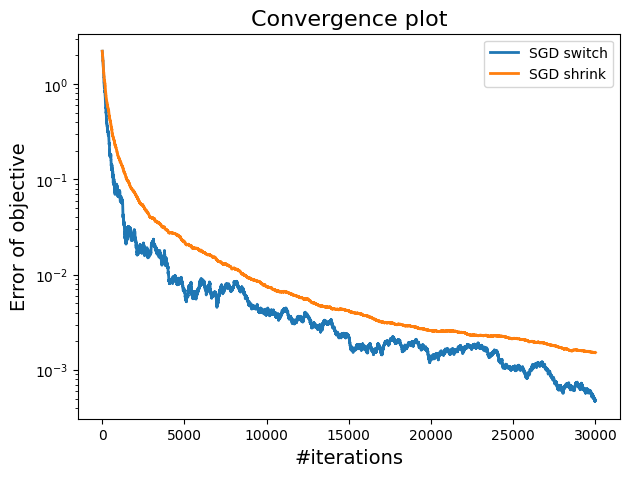
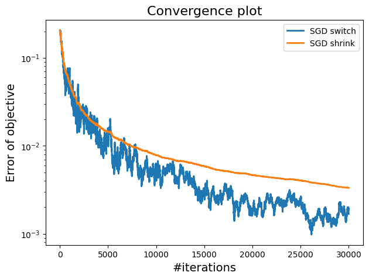

This repository contains the  python implementation of Stochastic Gradient Descent (SGD)  and its variates applied to the  Ridge Regression and Ridge Logistic Regression.

# Introduction

Gradient descent is widely used in machine learning to minimise model loss functions. However, due to its computational intensity, a more efficient algorithm, stochastic gradient descent (SGD), is often preferred. Unlike gradient descent, SGD updates model parameters using individual samples or small batches, which significantly reduces computational load specially for large datasets [[1]](ref1)

SGD with a constant step size struggles with noise in gradient estimates, causing the algorithm to oscillate around the minima and preventing precise convergence .\\
 To mitigate this issue, variance reduction techniques such as SVRG \cite[[2]](ref2)and SAGA [[3]](ref3), along with optimized step size strategies, are employed.\\

This project evaluates the performance and convergence of various SGD variants and traditional gradient descent methods with different step size settings. The methods are tested on two synthetic datasets: one with high correlation and one with low correlation among features, and applied to the solve the  ridge penalized empirical risk minimization for both regression and classification.

# Experiments

### Data generation

We used a synthetic data with $50$ features and $1000$ samples was generated, using ground truth coefficients defined by 
 $$
w = (-1)^{idx} \cdot \exp(- idx) / 10
 $$

Two datasets were created: one with a high correlation of $0.7$ and the other with a low correlation of $0.1$. Both datasets were used in linear regression to compare behaviors.

### Choice of Model and Regularization

Linear Regression (LinReg) and Logistic Regression (LogReg) models both used regularization parameter $\lambda= \frac{1}{\sqrt{n}} \lambda=n$ to control complexity and improve generalization.

###  Experiments Results
In the experimental results, we conducted comparisons between methods using synthetic data with both high correlation ($\rho =0.7 $) and low correlation ($\rho =0.1 $) High correlation increases noise in gradient estimates, leading to more oscillations and instability. Methods better at managing noise, such as those with shrinking step sizes or momentum, perform better and achieve smoother convergence. In contrast, low correlation reduces noise, resulting in smoother and more effective convergence across all methods.

Highlighted below some of the comparisons of the results we obtain.

1. Comparing Shrinking Stepsizes and switch to shrink stepsizes
<figure>

<figcaption>Constant step and shrinking steps SGD: plots of  the errors of the objective vs iterations for 1) low correlated data and 2) higher correlated data.</figcaption>

</figure>

2. Comparing Shrinking Stepsizes and switch to shrink stepsizes:
<figure>

<figcaption>Shrinking and switching steps SGD: plots of  the errors of the objective vs iterations for 1) low correlated data and 2) higher correlated data.</figcaption>
</figure>

We refer  to the main report for further details.

### Requirements
A working computer with:
- a python compiler
- numpy 
- matplotlib 
- scipy

### References
<a id="ref1">[1]</a> Bottou, Léon (2010) . Large-scale machine learning with stochastic gradient descent. Proceedings of COMPSTAT'2010: 19th International Conference on Computational StatisticsParis France, August 22-27, 2010 Keynote, Invited and Contributed Papers. p. 177--186. Springer

<a id="ref2"> [2] </a>
Defazio, Aaron and Bach, Francis and Lacoste-Julien, Simon (2014) . SAGA: A fast incremental gradient method with support for non-strongly convex composite objectives. Advances in neural information processing systems, vol.27.

<a id="ref3">[3] </a>
Johnson, Rie and Zhang, Tong(2013). Accelerating stochastic gradient descent using predictive variance reduction. Advances in neural information processing systems, vol. 26.
### Contributors
- Ahmed 
- Najlaa
- Jeremie

